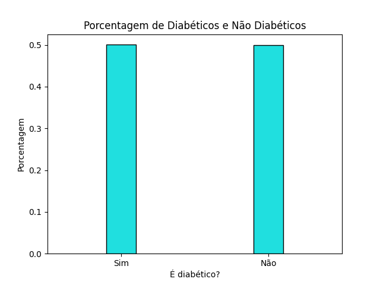
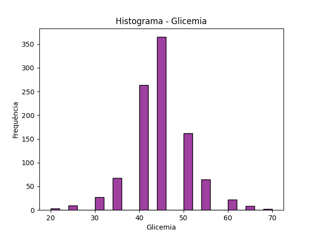
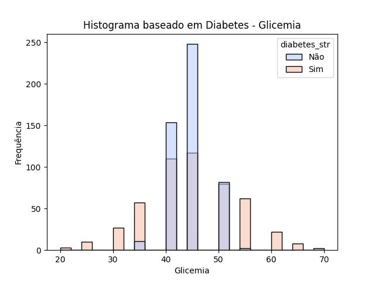
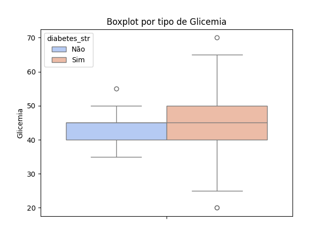
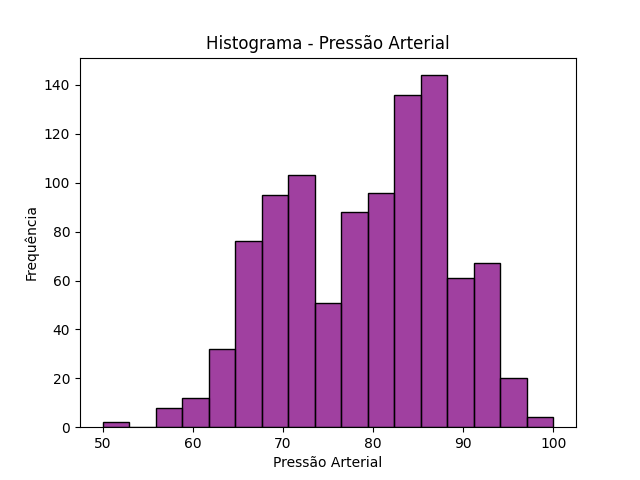
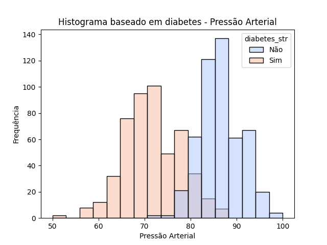
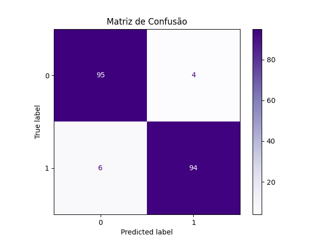

# Modelo de Classificação de Diabetes usando Naive Bayes


## Resumo
Modelo de classificação de pessoas quanto a diabetes. O modelo usa classificação Naive Bayes para tentar se adequar ao problema.
É disposto uma API para testar o modelo no final. Só há 2 variáveis independentes, logo o modelo é simples e fictício.

## Bibliotecas utilizadas
1. pandas
2. matplotlib
3. seaborn
4. statsmodels
5. scikit-learn
6. flask
7.  pydantic
8.  flask-pydantic
9.  pyarrow
10. kaleido
11. ipywidgets
12. nbformat
13. matplotlib-stubs

## Como rodar projeto
### Rodar API
```bash
pipenv sync
pipenv shell
python api.py
```
### Rodar construção do modelo
```bash
pipenv sync
pipenv shell
python modelo_diabetes.py
```
### Observação
> Requer Python 3.11 instalado.

## Análise Exploratória do Modelo - EDA
Análise exploratŕoia das 3 variáveis: Glicemia, Pressão Arterial e Diabetes

### Diabetes - Target


Pela distribuição proporcional de indivíduos com e sem diabetes, vê-se uma distribuição muito próxima da uniforme.

### Glicemia


Pela distribuição da glicemia, verifica-se uma distribuição normal.



Contudo, pela influência da diabete, vê-se claramaente que indivíduos em extremos tendem a ter diabetes, enquanto indivíduos ao meio tenbdem a não ter.



É possível ver pelo boxplot como os dados de indíviduos com diabetes tem uma aplitude maior, enquanto os dados de indivíduos sem diabetes tem uma amplitude menor. Os outliers possuem explicação científica, logo não serão transformados, embora sejam casos raros.

### Pressão Arterial


A distribuição da pressão arterial se aproxima grosseiramente de uma distribuição normal com assimetria à esquerda(cauda à esquerda).



Ao ver a influência de ter diabetes ou não, vê-se um claro deslocamento à esquerda do gráfico para indivíduos com diabetes. Assim, pode-se dizer que indivíduos com diabetes tendem a ter menor pressão arterial que indivíduos sem diabetes.
> Contudo, isso é uma particularidade dessa amostra, pois, na realidade, sabemos que indivíduos com diabetes tendem a ter pressão arterial maior, logo já podemos indicar isso como um ponto de melhoria do modelo.

## Treinamento do modelo
Utilizou-se o uso do algoritmo Naive Bayes para se adequar ao problema, separando 80% dos dados para treinamento e 20% para testes.

## Conclusões
### Métricas
|Recall|Precisão|F1-Score|
|:-:|:-:|:-:|
|0.95|0.95|0.95|

O modelo mostra que as métricas obtidas são muito boas, logo ele é capaz de explicar a amostra.

### Matriz de Confusão


A matriz de confusão elustra esses resultados:
+ Há 4 falsos positivos (alta precisão).
+ Há 6 falsos negativos (alto recall).
+ Há 189 registros classificados corretamente.

### Melhorias sugeridas para o modelo
+ Na prática, indivíduos com diabetes tendem a ter pressão arterial maior, logo esse dataset não descreve bem a situação real, visto que os coloca com pressão arterial menor.
+ Na prática, indivíduos com diabetes tendem a ter glicemia mais alta devido à baixa presença de insulina, ou até mesmo a ausência desta. Logo esses indivíduos não estão em ambos os extremos de glicemia, mas provavelmente devem estar deslocados mais à direita do histograma de glicemia, pois acabam retendo mais glicose no sangue.
+ Há poucas variáveis e poucos registros, logo maior complexidade deveria ser dada para um modelo como este.

## Créditos
Pedro Sodré, 7 de Junho de 2026